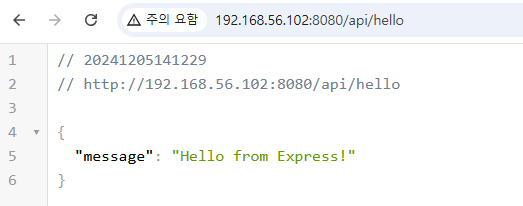

# 실습: React + Express + Nginx 구성에서 SSL/TLS 설정

전체소스코드: [https://github.com/comstudyschool/ssltls-nginx-node-react.git](https://github.com/comstudyschool/ssltls-nginx-node-react.git)

이 실습에서는 **React 프론트엔드**, **Node.js Express 백엔드**, 그리고 **Nginx 리버스 프록시**를 사용하여 HTTPS 환경을 설정합니다. 

### 작업 순서:

1. docker compose 준비
2. nginx 빌드 및 실행 테스트
3. bakcend nodejs express 서버 빌드 및 실행 테스트
4. react 프로젝트 생성 후 backend와 ajax 통신 및 프론트엔드 프로젝트 빌드
5. nginx에서 ssl/tls 설정

---

### 프로젝트 구성

- frontend는 cra로 생성
- backaend는 npm으로 생성
- nginx에서 ssl/tls 인증

```
project/
├── backend/               # Express 서버
│   ├── server.js
│   └── package.json
├── frontend/              # React 앱
│   ├── public/
│   ├── src/
│   ├── package.json
│   └── build/             # React 빌드 결과물
├── nginx/
│   └── default.conf       # Nginx 설정 파일
└── docker-compose.yml     # Docker Compose 구성
```

---

# **0단계: 프로젝트 디렉토리 준비**

ubuntu 환경에서 docker와 docker compose를 이용해서 실행 합니다. 미리 docker, docker-compose, node.js가 설치 되어 있어야 합니다.

```bash
mkdir -p project/backend project/frontend project/nginx
cd project
```

---

# **1단계: Nginx만 빌드 및 실행하고 접속 테스트**

### **1. Nginx 설정 파일**

- Nginx를 실행하여 정적 HTML 파일 제공 테스트.
- Nginx는 **포트 80**에서 요청을 수신하고,
    
    루트 URL(`/`) 요청 시 `/usr/share/nginx/html/index.html` 파일을 반환합니다.
    
- 이 설정은 주로 **정적 웹사이트**(HTML 파일, 이미지 등)를 호스팅하는 데 사용됩니다.

**`nginx/default.con`**

```
server {
    listen 80;
    server_name localhost;

    location / {
        root /usr/share/nginx/html;
        index index.html;
    }
}
```

### **2. 정적 HTML 파일 생성**

설정 파일에서 다음과 같이 설정 하였기 때문에 nginx 디렉토리 상단에 index.html 파일을 위치 시킵니다.

location / {
        root /usr/share/nginx/html;
        index index.html;
 }

**`nginx/index.html`**

```html
<!DOCTYPE html>
<html lang="en">
<head>
    <meta charset="UTF-8">
    <title>Nginx Test</title>
</head>
<body>
    <h1>Nginx is running! by KBJ</h1>
</body>
</html>
```

### **3. Nginx Dockerfile**

- **`COPY default.conf /etc/nginx/conf.d/default.conf`**:
    - 로컬 디렉토리에 있는 `default.conf` 파일을 컨테이너 내부의 **Nginx 설정 디렉토리**(`/etc/nginx/conf.d/`)로 복사합니다.
    - Nginx의 동작 방식을 사용자 정의 설정으로 교체.
- **`COPY index.html /usr/share/nginx/html/index.html`**:
    - 로컬 디렉토리에 있는 `index.html` 파일을 Nginx의 기본 정적 파일 경로 **`/usr/share/nginx/html`*에 복사합니다.
    - Nginx가 루트 URL(`/`) 요청 시 해당 HTML 파일을 반환하도록 설정.

**`nginx/Dockerfile`**

```docker
FROM nginx:latest
COPY default.conf /etc/nginx/conf.d/default.conf
COPY index.html /usr/share/nginx/html/index.html
```

### **4. Docker Compose 파일**

- **`nginx`**:
    - **Nginx 컨테이너 서비스**를 정의.
    - `./nginx` 디렉토리를 사용해 이미지를 빌드.
- **`ports`**:
    - 호스트의 포트 `8080`을 컨테이너의 포트 `80`에 매핑.
    - 브라우저에서 `http://localhost:8080`으로 접속하면 Nginx 서버가 응답.

**`docker-compose.yml`**

- docker-compose.yml 파일은 nginx 디렉토리 외부에 위치 합니다.

```yaml
version: "3.8"
services:
  nginx:
    build: ./nginx
    ports:
      - "8080:80"
```

### **실행**

```bash
# 빌드 및 실행
docker-compose up -d --build

# 도커 컨테이너 실행 확인
docker compose ps -a
```

- 실행 예

```bash
user1@VM1:~/project$ docker compose ps -a
WARN[0000] /home/user1/project/docker-compose.yml: the attribute `version` is obsolete, it will be ignored, please remove it to avoid potential confusion 
NAME              IMAGE           COMMAND                  SERVICE   CREATED         STATUS         PORTS
project-nginx-1   project-nginx   "/docker-entrypoint.…"   nginx     3 minutes ago   Up 3 minutes   0.0.0.0:8080->80/tcp, [::]:8080->80/tcp
user1@VM1:~/project$ 
```

### **테스트**

- 브라우저에서 `http://vm-ip:8080`로 접속하여 "Nginx is running!"이 표시되는지 확인.

---

# **2단계: Nginx에 Node.js Express 백엔드 연동 및 실행 테스트**

### **구성**

- Express 서버를 추가하고 `/api` 요청을 백엔드로 프록시.
- npm init -y 명령으로 초기화
- npm install express cors 등의 모듈 설치

### **파일 준비**

### **1. Express 서버 (`backend/server.js`)**

- 혹시나 있을 React 프로젝트에서 사용하는 port와 충돌을 피하기 위해 3001번 사용. React 프로젝트는 build 후 NginX 디렉토리로 옮겨 짐.

```jsx
const express = require('express');
const app = express();
const cors= require('cors');

app.use(cors());

app.get('/api/hello', (req, res) => {
    res.json({ message: 'Hello from Express!' });
});

const PORT = 3001;
app.listen(PORT, () => {
    console.log(`Express server running on http://localhost:${PORT}`);
});
```

### **2. Express Dockerfile (`backend/Dockerfile`)**

```docker
FROM node:16
WORKDIR /app
COPY package*.json ./
RUN npm install
COPY . .
EXPOSE 3001
CMD ["node", "server.js"]
```

### **3. Express `package.json`**

```json
{
  "name": "backend",
  "version": "1.0.0",
  "main": "server.js",
  "scripts": {
    "test": "echo \"Error: no test specified\" && exit 1"
  },
  "keywords": [],
  "author": "",
  "license": "ISC",
  "description": "",
  "dependencies": {
    "cors": "^2.8.5",
    "express": "^4.21.1"
  }
}
```

### **Nginx 설정 파일 수정**

1. **`location /api` 추가**:
    - `/api` 경로로 들어오는 요청을 **백엔드 서버(`http://backend:3001`)**로 프록시합니다.
    - **이유**: 프런트엔드가 API 요청을 처리하기 위해 백엔드 서버와 통신하도록 설정.
2. **`proxy_pass http://project-backend-1:3001;`**:
    - `/api`로 들어온 요청을 **`project-backend-1`**라는 서비스 이름으로 설정된 Express 서버(포트 3001)로 전달.
    - **이유**: Docker Compose 환경에서 서비스 이름을 통해 백엔드 컨테이너(실행 컨테이너 이름)와 통신.
3. **`proxy_set_header`**:
    - **요청 헤더 설정**:
        - **`Host`**: 원래 요청의 호스트 이름 전달.
        - **`X-Real-IP`**: 클라이언트의 실제 IP 주소 전달.
        - **`X-Forwarded-For`**: 프록시 체인을 통해 클라이언트의 원본 IP 주소 전달.
    - **이유**: 백엔드 서버가 클라이언트의 요청 정보를 정확히 확인하도록 지원.

수정된 설정은 Nginx를 **리버스 프록시**로 사용하여 `/api` 요청을 백엔드 서버로 전달하도록 구성하며, 클라이언트 정보를 유지하기 위해 헤더를 추가합니다.

**(`nginx/default.conf`)**

```
server {
    listen 80;
    server_name localhost;

    location / {
        root /usr/share/nginx/html;
        index index.html;
    }

    location /api {
        proxy_pass http://project-backend-1:3001;
        proxy_set_header Host $host;
        proxy_set_header X-Real-IP $remote_addr;
        proxy_set_header X-Forwarded-For $proxy_add_x_forwarded_for;
    }
}
```

1. **Docker Compose 업데이트**
- **`depends_on`**으로 명시된 서비스가 먼저 시작됩니다. **`nginx`** 서비스는 **`backend`** 서비스가 먼저 실행된 후 시작됩니다.
- 서비스가 "완전히 준비되었는지" 확인하려면 **`healthcheck`**를 사용해야 합니다.

```yaml
version: "3.8"
services:
  nginx:
    build: ./nginx
    ports:
      - "8080:80"
    depends_on:
      - backend

  backend:
    build: ./backend
    ports:
      - "3001:3001"
```

### **실행**

```bash
docker-compose down
docker-compose up -d --build
docker-compose ps -a
```

- 실행 결과

```bash
user1@VM1:~/project$ docker compose up -d --build
WARN[0000] /home/user1/project/docker-compose.yml: the attribute `version` is obsolete, it will be ignored, please remove it to avoid potential confusion 
[+] Building 3.6s (20/20) FINISHED                                                                                                                           docker:default
 => [backend internal] load build definition from Dockerfile                                                                                                           0.1s
 ... 중간 생략 ...
 => [nginx] resolving provenance for metadata file                                                                                                                     0.0s
[+] Running 3/3
 ✔ Network project_default      Created                                                                                                                                0.4s 
 ✔ Container project-backend-1  Started                                                                                                                                1.1s 
 ✔ Container project-nginx-1    Started                                                                                                                                1.7s 
user1@VM1:~/project$ docker compose ps
WARN[0000] /home/user1/project/docker-compose.yml: the attribute `version` is obsolete, it will be ignored, please remove it to avoid potential confusion 
NAME                IMAGE             COMMAND                  SERVICE   CREATED          STATUS          PORTS
project-backend-1   project-backend   "docker-entrypoint.s…"   backend   11 seconds ago   Up 11 seconds   3000/tcp, 0.0.0.0:3001->3001/tcp, :::3001->3001/tcp
project-nginx-1     project-nginx     "/docker-entrypoint.…"   nginx     11 seconds ago   Up 10 seconds   0.0.0.0:8080->80/tcp, [::]:8080->80/tcp
user1@VM1:~/project$ docker logs project-backend-1
Express server running on http://localhost:3001
user1@VM1:~/project$ docker logs project-nginx-1
/docker-entrypoint.sh: /docker-entrypoint.d/ is not empty, will attempt to perform configuration
... 중간 생략 ...
2024/12/05 05:11:00 [notice] 1#1: start worker process 28
user1@VM1:~/project$ curl http://localhost:3001/api/hello
{"message":"Hello from Express!"}user1@VM1:~/project$
```

### **테스트**

- 브라우저에서 `http://vm-ip:8080/api/hello`로 접속하여 Express 서버의 응답 `{"message": "Hello from Express!"}`를 확인.



---

# **3단계: React 프로젝트 생성 및 실행 후 빌드, 2단계와 연동**

### **구성**

- React 프로젝트를 생성하고 빌드하여 Nginx에서 서빙.

### **파일 준비**

1. **React 프로젝트 생성**

```bash
npx create-react-app frontend
```

### **1. React `App.js` 수정**

```jsx
import React, { useState, useEffect } from 'react';

function App() {
    const [message, setMessage] = useState('');

    useEffect(() => {
        fetch('http://192.168.56.102:8080/api/hello')
            .then((res) => res.json())
            .then((data) => setMessage(data.message));
    }, []);

    return (
        <div>
            <h1>React + Express + Nginx</h1>
            <p>Message from API: {message}</p>
        </div>
    );
}

export default App;
```

1. **React 빌드**

```bash
cd frontend
npm run build
```

### **2. Nginx 설정 파일 수정**

- **`try_files $uri /index.html`**:
    - 요청된 파일이 존재하면 반환.
    - 파일이 없으면 `index.html`을 반환하여 SPA 라우팅을 지원.
- **SPA 애플리케이션을 Nginx에서 호스팅할 때 필수 설정**입니다.

 **`nginx/default.conf`**

```
server {
    listen 80;
    server_name localhost;

    location / {
        root /usr/share/nginx/html;
        index index.html;
        try_files $uri /index.html;
    }

    location /api {
        proxy_pass http://project-backend-1:3001;
        proxy_set_header Host $host;
        proxy_set_header X-Real-IP $remote_addr;
        proxy_set_header X-Forwarded-For $proxy_add_x_forwarded_for;
    }
}
```

### **3. Docker Compose 업데이트**

```yaml
version: "3.8"
services:
  nginx:
    build: ./nginx
    ports:
      - "80:80"
    depends_on:
      - backend
      - frontend

  backend:
    build: ./backend
    ports:
      - "3001:3001"

  frontend:
    build: ./frontend
```

### **4.** `React frontend` Dockerfile

React의 빌드 결과물을 Nginx에서 서빙하도록 설정: React 빌드에만 초점을 맞추고, 빌드 결과물은 로컬 또는 Docker 볼륨을 통해 Nginx와 공유.

```bash
# 1단계: Node.js 환경에서 React 빌드
FROM node:16 AS build
# 작업 디렉토리 설정
WORKDIR /app
# React 프로젝트의 package.json과 package-lock.json 복사
COPY package*.json ./
# React 프로젝트의 의존성 설치
RUN npm install
# 모든 React 소스 파일 복사
COPY . .
# React 애플리케이션 빌드
RUN npm run build

# Nginx를 사용한 정적 파일 제공
FROM nginx:latest
COPY --from=build /app/build /usr/share/nginx/html
EXPOSE 80
CMD ["nginx", "-g", "daemon off;"]
```

### **실행**

```bash
docker-compose down

docker-compose up -d --build
```

- 실행 결과

```bash
user1@VM1:~/project$ docker compose up -d --buil
[+] Building 56.0s (30/30) FINISHED                                                                                                                          docker:default
... 중간 생략 ...                                                                                                                     0.0s
[+] Running 4/4
 ✔ Network project_default       Created                                                                                                                               0.4s 
 ✔ Container project-frontend-1  Started                                                                                                                               1.6s 
 ✔ Container project-backend-1   Started                                                                                                                               1.9s 
 ✔ Container project-nginx-1     Started                                                                                                                               3.1s 
user1@VM1:~/project$ docker compose ps -a
NAME                 IMAGE              COMMAND                  SERVICE    CREATED          STATUS          PORTS
project-backend-1    project-backend    "docker-entrypoint.s…"   backend    28 seconds ago   Up 27 seconds   3000/tcp, 0.0.0.0:3001->3001/tcp, :::3001->3001/tcp
project-frontend-1   project-frontend   "/docker-entrypoint.…"   frontend   28 seconds ago   Up 27 seconds   80/tcp
project-nginx-1      project-nginx      "/docker-entrypoint.…"   nginx      28 seconds ago   Up 25 seconds   0.0.0.0:8080->80/tcp, [::]:8080->80/tcp
user1@VM1:~/project$ 
```

### **테스트 후 보완**

- 브라우저에서 `http://localhost`로 접속하여 React 프런트엔드와 Express 백엔드 연동 확인.
- React hompage를 찾지 못하면 `nginx/default.conf`를 수정 하고 재실행.

```
server {
    listen 80;
    server_name localhost;

    root /usr/share/nginx/html;
    index index.html;

    location / {
        try_files $uri /index.html;
    }

    location /api {
        proxy_pass http://project-backend-1:3001;
        proxy_set_header Host $host;
        proxy_set_header X-Real-IP $remote_addr;
        proxy_set_header X-Forwarded-For $proxy_add_x_forwarded_for;
    }

    location ~* \.(js|css|png|jpg|jpeg|gif|ico|svg|ttf|woff|woff2|eot)$ {
        try_files $uri =404;
    }
}
```

- Nginx 컨테이너 내부 확인 :

```bash
docker exec -it project-nginx-1 ls /usr/share/nginx/html
docker exec -it project-nginx-1 ls /usr/share/nginx/html/static/js
```

- 실행 결과

```bash
user1@VM1:~/project$ docker exec -it project-nginx-1 ls /usr/share/nginx/html
50x.html  index.html
user1@VM1:~/project$ docker exec -it project-nginx-1 ls /usr/share/nginx/html/static/js
ls: cannot access '/usr/share/nginx/html/static/js': No such file or directory
```

만약 frontend의 build결과가 Nginx 컨테이너로 복사 되지 않았다면 다음 단계를 수동으로 복사.

---

### **다음 단계: 추가 확인 사항**

**React `homepage` 설정**

React `package.json`에 `homepage` 속성이 누락되었다면 파일 경로 문제가 발생할 수 있습니다. `package.json`에 다음을 추가합니다:

- package.json 수정
    
    ```json
    "homepage": "."
    ```
    
    package.json에 homepage 항목 추가 후 빌 및 복사
    
    ```bash
    # 추가 후 React frontend 다시 빌드
    npm run build
    
    # 컨테이너에 빌드 파일 직접 복사
    docker cp frontend/build/. project-nginx-1:/usr/share/nginx/html
    ```
    
    - 실행 결과
    
    ```bash
    user1@VM1:~/project$ docker cp frontend/build/. project-nginx-1:/usr/share/nginx/html
    Successfully copied 563kB to project-nginx-1:/usr/share/nginx/html
    ```
    
- **Ract 빌드 파일이 복사되지 않은 경우**:
React의 `build` 디렉토리에서 파일을 Nginx 디렉토리로 수동 복사:
    
    ```bash
    cp -r frontend/build/* nginx/
    ```
    
- **Nginx 컨테이너에서 정적 파일 직접 요청**:
Nginx 내부에서 `main.js` 파일이 접근 가능한지 테스트:
    
    ```bash
    docker exec -it project-nginx-1 curl http://localhost/static/js/main.7c75c4c9.js
    ```
    
    - 200 OK 응답이 나와야 정상입니다.
- 브라우저에서 접속 Nginx서버로 접속 하면 React frontend 페이지가 보이게 된다.
    
    
    

---

여기까지 ssl/tls 설정 없이 Nginx + React + Nodejs 연동 결과 입니다.  여기까지 설정이 끝났다면 다음 Nginx에 ssl/tls 설정을 진행 합니다. 

# **4단계: Nginx에 SSL/TLS 설정**

### **구성**

- Self-signed SSL 인증서를 생성하고 HTTPS 설정.

```
project/
├── backend/               # Express 서버
│   ├── server.js
│   └── package.json
├── frontend/              # React 앱
│   ├── public/
│   ├── src/
│   ├── package.json
│   └── build/             # React 빌드 결과물
├── nginx/
│   ├── default.conf       # Nginx 설정 파일
├── certs/                 # Self-signed 인증서 디렉토리
│   ├── selfsigned.crt     # 인증서 파일
│   └── selfsigned.key     # 키 파일
├── docker-compose.yml     # Docker Compose 구성
```

### **파일 준비**

1. **Self-signed 인증서 생성**

이 명령은 프로젝트의 최상위 디렉토리에서 실행하는 것이 일반적입니다.

```bash
mkdir certs
openssl req -x509 -nodes -days 365 -newkey rsa:2048 \
  -keyout certs/selfsigned.key \
  -out certs/selfsigned.crt \
  -subj "/CN=localhost"
```

1. **Nginx 설정 파일 수정 (`nginx/default.conf`)**

```
server {
    listen 80;
    server_name localhost;
    return 301 https://$host$request_uri;
}

server {
    listen 443 ssl;
    server_name localhost;

    ssl_certificate /etc/ssl/selfsigned.crt;
    ssl_certificate_key /etc/ssl/selfsigned.key;

    root /usr/share/nginx/html;
    index index.html;

    location / {
        try_files $uri /index.html;
    }

    location /api {
        proxy_pass http://project-backend-1:3001;
        proxy_set_header Host $host;
        proxy_set_header X-Real-IP $remote_addr;
        proxy_set_header X-Forwarded-For $proxy_add_x_forwarded_for;
    }

    location ~* \.(js|css|png|jpg|jpeg|gif|ico|svg|ttf|woff|woff2|eot)$ {
        try_files $uri =404;
    }
}
```

### **실행**

```bash
docker-compose down

docker-compose up -d --build
```

- docker-compose 실행 확인

```bash
[+] Running 4/4
 ✔ Network project_default       Created                                                                                                                               0.4s 
 ✔ Container project-backend-1   Started                                                                                                                               1.9s 
 ✔ Container project-frontend-1  Started                                                                                                                               1.6s 
 ✔ Container project-nginx-1     Started                                                                                                                               2.7s 
user1@VM1:~/project$ docker compose ps -a
NAME                 IMAGE              COMMAND                  SERVICE    CREATED         STATUS         PORTS
project-backend-1    project-backend    "docker-entrypoint.s…"   backend    3 minutes ago   Up 3 minutes   3000/tcp, 0.0.0.0:3001->3001/tcp, :::3001->3001/tcp
project-frontend-1   project-frontend   "/docker-entrypoint.…"   frontend   3 minutes ago   Up 3 minutes   80/tcp
project-nginx-1      project-nginx      "/docker-entrypoint.…"   nginx      3 minutes ago   Up 3 minutes   0.0.0.0:443->443/tcp, :::443->443/tcp, 0.0.0.0:8080->80/tcp, [::]:8080->80/tcp
user1@VM1:~/project$ 

```

### **테스트**

- 브라우저에서 http://192.168.56.102:8080 —> https://192.168.56.102 로 접속하면  HTTPS 설정 확인.

---

# **Docker Compose 전체 내용**

### `docker-compose.yml` 작성

```yaml
services:
  nginx:
    build: ./nginx
    ports:
      - "8080:80"
      - "443:443"
    depends_on:
      - backend
      - frontend
    volumes:
      - ./certs/selfsigned.crt:/etc/ssl/selfsigned.crt
      - ./certs/selfsigned.key:/etc/ssl/selfsigned.key
      - ./nginx/default.conf:/etc/nginx/conf.d/default.conf
      - ./frontend/build:/usr/share/nginx/html

  backend:
    build: ./backend
    ports:
      - "3001:3001"

  frontend:
    build: ./frontend
    stdin_open: true
```

---

# 리버스 프록시 설정 (API 요청)

## Mixed Content 문제


## **문제 분석: Mixed Content 에러**

```
## 크롬 Console 에러 메시지:
**Mixed Content: The page at 'https://192.168.56.102:8443/' was loaded over HTTPS, but requested an insecure resource 'http://192.168.56.102:8080/api/hello'. This request has been blocked; the content must be served over HTTPS.**

## 해석
Mixed Content: 'https://192.168.56.102/' 페이지가 HTTPS를 통해 로드되었지만 안전하지 않은 리소스 'http://192.168.56.102:8080/api/hello'를 요청했습니다. 이 요청은 차단되었습니다. 콘텐츠는 HTTPS를 통해 제공되어야 합니다.
```

이는 React 앱이 HTTPS를 통해 로드되었으나, 백엔드 API 요청이 HTTP를 통해 이루어지면서 발생한 **Mixed Content** 문제입니다. 브라우저는 보안상 이유로 HTTPS 페이지에서 HTTP 리소스를 차단합니다.

---

## **해결 방법: Nginx 리버스 프록시 설정**

docker-compose.yml에 설정한 백엔드 포트 3001과 backend의 Dockerfile, servler.js 모두 3001번 포트로 일치하도록 설정 해야 합니다.  그리고 nginx/default.conf 에 리버스 프록시 설정도 3001로 설정 해야 합니다. 

그리고 docker 내부 네트워크 목록 확인 및 세부 정보 확인 하고 같은 네트워크를 사용하는지 확인합니다.

```bash
user1@VM1:~/project$ docker network ls
NETWORK ID     NAME              DRIVER    SCOPE
f1e5aeb8fe5c   bridge            bridge    local
1b2fbe76c84b   host              host      local
b5d2fbf75351   none              null      local
8bb71dbd2998   project_default   bridge    local
user1@VM1:~/project$ docker network inspect project_default

```

1. **Nginx를 리버스 프록시로 설정하여 React와 백엔드 API 요청 모두 HTTPS를 통해 이루어지도록 구성합니다.**
    - React 애플리케이션의 `/api` 요청을 Nginx에서 백엔드 서버로 프록시합니다.
2. **Nginx 설정 파일 (`nginx/default.conf`) 수정**:
    
    ```
    server {
        listen 443 ssl;
        server_name localhost;
    
        ssl_certificate /etc/ssl/selfsigned.crt;
        ssl_certificate_key /etc/ssl/selfsigned.key;
    
        # React 정적 파일 제공
        root /usr/share/nginx/html;
        index index.html;
    
        location / {
            try_files $uri /index.html;
        }
    
        # 리버스 프록시 설정 (API 요청) - Docker 네트워크를 통해 백엔드와 연결
        location /api {
            proxy_pass http://project-backend-1:3001; 
            proxy_set_header Host $host;
            proxy_set_header X-Real-IP $remote_addr;
            proxy_set_header X-Forwarded-For $proxy_add_x_forwarded_for;
        }
    }
    ```
    
    - **`proxy_pass`**: `/api` 경로로 들어온 요청을 백엔드 서버(`http://project-backend-1:3001`)로 전달.
    - **`proxy_set_header`**: 클라이언트 요청 정보를 백엔드로 전달.
    - **Docker 네트워크 사용**: `project-backend-1`는 Docker Compose에서 정의된 백엔드 컨테이너 이름입니다.
3. **HTTP를 HTTPS로 리디렉션 (선택 사항)**:
HTTP 요청을 HTTPS로 자동 리디렉션합니다.
    
    ```
    server {
        listen 80;
        server_name localhost;
    
        return 301 https://$host$request_uri;
    }
    ```
    

---

### **4. React의 `App.js` 수정**

React 코드에서 **절대 URL 대신 상대 URL**을 사용하여 API 요청을 보냅니다. Nginx가 프록시 역할을 하기 때문에, 프론트엔드에서 API를 호출할 때 `http://192.168.56.102:8080`을 명시할 필요가 없습니다.

수정된 `App.js`:

```jsx
import React, { useState, useEffect } from 'react';

function App() {
    const [message, setMessage] = useState('');

    useEffect(() => {
        fetch('/api/hello') // 상대 경로로 수정
            .then((res) => res.json())
            .then((data) => setMessage(data.message));
    }, []);

    return (
        <div>
            <h1>React + Express + Nginx</h1>
            <p>Message from API: {message}</p>
        </div>
    );
}

export default App;
```

---

### **5. `docker-compose.yml` 확인**

리버스 프록시가 제대로 동작하려면 Nginx와 백엔드 컨테이너가 동일한 네트워크에 있어야 합니다. `docker-compose.yml`에서 네트워크 구성을 확인하세요.

```yaml
version: "3.8"
services:
  nginx:
    build: ./nginx
    ports:
      - "443:443"
      - "80:80"
    volumes:
      - ./certs:/etc/ssl
      - ./nginx/default.conf:/etc/nginx/conf.d/default.conf
      - ./frontend/build:/usr/share/nginx/html
    depends_on:
      - backend

  backend:
    build: ./backend
    ports:
      - "3001:3001"
```

---

### **6. 컨테이너 재시작**

Nginx 설정을 수정한 후, 컨테이너를 다시 빌드하고 실행합니다.

```bash
docker-compose down
docker-compose up --build

```

---

### **7. 테스트**

1. 브라우저에서 HTTPS로 React 앱에 접속:
    
    ```
    https://192.168.56.102:443
    
    ```
    
2. 브라우저 개발자 도구(Console 탭)에서 Mixed Content 에러가 사라졌는지 확인합니다.
3. 정상적으로 백엔드에서 메시지가 출력되는지 확인합니다.

---

### **결론**

Nginx를 리버스 프록시로 설정하여 `/api` 요청을 백엔드 서버로 전달함으로써 HTTPS 환경에서 Mixed Content 문제를 해결할 수 있습니다. 또한 React 코드에서 상대 경로(`/api/hello`)를 사용하도록 수정하여 프록시 설정을 활용했습니다.


# 전체 소스 코드

```
project/
├── backend/               # Express 서버
│   ├── server.js
│   └── package.json
├── frontend/              # React 앱
│   ├── public/
│   ├── src/
│   ├── package.json
│   └── build/             # React 빌드 결과물
├── nginx/
│   ├── default.conf       # Nginx 설정 파일
├── certs/                 # Self-signed 인증서 디렉토리
│   ├── selfsigned.crt     # 인증서 파일
│   └── selfsigned.key     # 키 파일
├── docker-compose.yml     # Docker Compose 구성
```

- project/backend/Dockerfile
    
    ```
    FROM node:16
    WORKDIR /app
    COPY package*.json ./
    RUN npm install
    COPY . .
    EXPOSE 3001
    CMD ["node", "server.js"]
    
    ```
    
- proejct/backend/server.js
    
    ```
    const express = require('express');
    const app = express();
    const cors= require('cors');
    
    app.use(cors());
    
    app.get('/api/hello', (req, res) => {
        res.json({ message: 'Hello from Express!' });
    });
    
    const PORT = 3001;
    app.listen(PORT, () => {
        console.log(`Express server running on http://localhost:${PORT}`);
    });
    ```
    
- project/frontend/Dockerfile
    
    ```
    # 1단계: Node.js 환경에서 React 빌드
    FROM node:16 AS build
    
    # 작업 디렉토리 설정
    WORKDIR /app
    
    # React 프로젝트의 package.json과 package-lock.json 복사
    COPY package*.json ./
    
    # React 프로젝트의 의존성 설치
    RUN npm install
    
    # 모든 React 소스 파일 복사
    COPY . .
    
    # React 애플리케이션 빌드
    RUN npm run build
    
    # Nginx를 사용한 정적 파일 제공
    FROM nginx:latest
    COPY --from=build /app/build /usr/share/nginx/html
    EXPOSE 80
    CMD ["nginx", "-g", "daemon off;"]
    
    ```
    
- project/frontend/src/App.js
    
    ```
    import React, { useState, useEffect } from 'react';
    
    function App() {
        const [message, setMessage] = useState('');
    
        useEffect(() => {
            fetch('/api/hello')
                .then((res) => res.json())
                .then((data) => setMessage(data.message));
        }, []);
    
        return (
            <div>
                <h1>React + Express + Nginx</h1>
                <p>Message from API: {message}</p>
            </div>
        );
    }
    
    export default App;
    
    ```
    
- project/nginx/Dockerfile
    
    ```docker
    FROM nginx:latest
    COPY default.conf /etc/nginx/conf.d/default.conf
    COPY index.html /usr/share/nginx/html/index.html
    
    ```
    
- project/nginx/defualt.conf
    
    ```docker
    server {
        listen 80;
        server_name localhost;
        return 301 https://$host$request_uri;
    }
    
    server {
        listen 443 ssl;
        server_name localhost;
    
        ssl_certificate /etc/ssl/selfsigned.crt;
        ssl_certificate_key /etc/ssl/selfsigned.key;
    
        root /usr/share/nginx/html;
        index index.html;
    
        location / {
            try_files $uri /index.html;
        }
    
        location ~* \.(js|css|png|jpg|jpeg|gif|ico|svg|ttf|woff|woff2|eot)$ {
            try_files $uri =404;
        }
    
        # 리버스 프록시 설정 (API 요청)
        location /api {
            proxy_pass http://172.18.0.3:3001; # Docker 네트워크를 통해 백엔드와 연결
            proxy_set_header Host $host;
            proxy_set_header X-Real-IP $remote_addr;
            proxy_set_header X-Forwarded-For $proxy_add_x_forwarded_for;
        }
    }
    
    ```
    
- docker-compose.yml
    
    ```yaml
    services:
      nginx:
        build: ./nginx
        ports:
          - "8080:80"
          - "443:443"
        depends_on:
          - backend
          - frontend
        volumes:
          - ./certs/selfsigned.crt:/etc/ssl/selfsigned.crt
          - ./certs/selfsigned.key:/etc/ssl/selfsigned.key
          - ./nginx/default.conf:/etc/nginx/conf.d/default.conf
          - ./frontend/build:/usr/share/nginx/html
    
      backend:
        build: ./backend
        ports:
          - "3001:3001"
    
      frontend:
        build: ./frontend
        stdin_open: true
    
    ```
    

---

### **구성의 주요 특징**

1. **React + Express + Nginx 통합:**
    - React는 Nginx를 통해 정적 파일로 제공.
    - Nginx는 `/api` 경로로 들어오는 요청을 Express 백엔드로 리버스 프록싱.
    - Express는 `/api/hello` 요청을 처리하여 React와 통신.
2. **HTTPS 환경 설정:**
    - Self-signed 인증서를 사용하여 HTTPS를 구현.
    - HTTP 요청은 Nginx에서 HTTPS로 리디렉션.
3. **Docker 기반 프로젝트:**
    - 모든 서비스(Frontend, Backend, Nginx)를 Docker 컨테이너로 실행.
    - Docker Compose를 사용하여 간단하게 네트워크와 서비스를 구성.
4. **코드 구조와 네트워크 통합:**
    - `docker-compose.yml`에서 각 서비스가 명확하게 역할을 수행하며 동일한 네트워크에 연결됨.
    - React → Nginx → Express 백엔드 요청 흐름이 잘 동작.

---

### **개선 및 최적화 가능성**

### **1. `default.conf`에서 백엔드 주소**

현재 `default.conf`에서 `proxy_pass`는 Docker 네트워크 내부 IP (`172.18.0.3`)를 직접 사용하고 있습니다:

```
proxy_pass http://172.18.0.3:3001;

```

**개선안:**

- Docker 네트워크에서 컨테이너 이름(`project-backend-1`)을 사용하면 더 유연합니다:

```
proxy_pass http://project-backend-1:3001;

```

**이점:**

- Docker 네트워크 내 IP 주소 변경에 영향을 받지 않음.
- 컨테이너 이름을 사용하면 더 직관적.

---

### **2. React 프론트엔드의 HTTPS 경고 제거**

브라우저에서 Self-signed 인증서를 사용하면 HTTPS 경고가 표시됩니다. 이를 해결하려면 **Let's Encrypt** 인증서를 사용할 수 있습니다.

**방법:**

- Nginx에서 Certbot을 사용해 Let's Encrypt 인증서를 발급받아 적용.
- 도메인이 필요하며, 로컬 환경이 아닌 공용 서버에서만 가능합니다.

---

### **3. React 개발 환경 최적화**

현재 `frontend` 컨테이너는 `npm run build`를 통해 정적 파일을 빌드합니다. 개발 중에는 다음과 같은 개선이 가능합니다:

**개선안:**

- React 개발 환경에서는 `npm start`로 실행.
- `frontend` 서비스에 포트를 추가해 React 개발 서버에 접근:

```yaml
frontend:
  build: ./frontend
  ports:
    - "3000:3000" # React 개발 서버

```

---

### **테스트 및 배포 확인**

### **테스트**

1. HTTPS로 React 애플리케이션 접속:
    
    ```
    https://192.168.56.102
    
    ```
    
    - "React + Express + Nginx"와 API 메시지가 정상적으로 표시됨.
2. API 요청 테스트:
    - 브라우저 개발자 도구(Network 탭)에서 `/api/hello` 요청이 성공했는지 확인.

### **배포**

1. Docker Compose를 사용하여 모든 서비스 컨테이너를 쉽게 시작:
    
    ```bash
    docker-compose up --build
    
    ```
    
2. React 소스 수정 시:
    - Docker Compose를 재실행하거나 React 빌드 디렉토리(`/frontend/build`)를 업데이트.

---

백엔드 포트 설정의 일관성은 리버스 프록시가 올바르게 동작하기 위해 매우 중요합니다. 다음과 같이 **포트 번호를 일관되게 설정**해야 합니다:

---

### **1. Docker Compose 설정**

`docker-compose.yml`에서 백엔드의 포트를 **3001**로 설정:

```yaml
services:
  backend:
    build: ./backend
    ports:
      - "3001:3001" # 내부 컨테이너 포트 3001과 외부 포트 3001 매핑

```

---

### **2. Backend Dockerfile**

Backend 컨테이너가 내부적으로 **3001번 포트**에서 동작하도록 설정:

```
EXPOSE 3001 # Docker 컨테이너의 포트를 노출
CMD ["node", "server.js"] # 3001번 포트에서 server.js 실행

```

---

### **3. Backend Express 서버 (`server.js`)**

Express 애플리케이션이 **3001번 포트**를 수신 대기하도록 설정:

```jsx
const PORT = 3001; // 포트를 3001로 설정
app.listen(PORT, () => {
    console.log(`Express server running on http://localhost:${PORT}`);
});

```

---

### **4. Nginx 리버스 프록시 설정**

`nginx/default.conf`에서 리버스 프록시가 백엔드의 **3001번 포트**로 요청을 전달하도록 설정:

```
location /api {
    proxy_pass http://project-backend-1:3001; # Docker 네트워크를 통해 백엔드 컨테이너로 연결
    proxy_set_header Host $host;
    proxy_set_header X-Real-IP $remote_addr;
    proxy_set_header X-Forwarded-For $proxy_add_x_forwarded_for;
}

```

---

### **5. 전체 흐름**

1. 클라이언트가 React 앱을 통해 `/api/hello` 요청.
2. Nginx가 `/api` 경로의 요청을 **3001번 포트**의 백엔드 컨테이너로 전달.
3. 백엔드(Express)가 요청을 처리하고 JSON 응답 반환.

---

### **결론**

**포트 번호(3001)를 다음과 같이 일치시키는 것이 필수적입니다:**

- `docker-compose.yml`에서 포트 매핑.
- Backend Dockerfile에서 `EXPOSE`.
- Express 서버 코드(`server.js`)에서 `app.listen`.
- Nginx의 `proxy_pass` 설정.

이렇게 하면 요청 흐름이 정상적으로 이루어지고, 리버스 프록시를 통한 API 요청이 성공적으로 처리됩니다. 🚀

---

### **구성 확인**

- **Frontend**: React로 구현, Nginx에서 정적 파일을 제공.
- **Backend**: Express.js 서버, Nginx의 리버스 프록시를 통해 연결.
- **Nginx**:
    - React 정적 파일과 API 요청(`/api`)을 관리.
    - SSL/TLS(Self-signed 인증서) 설정으로 HTTPS 제공.
- **Docker Compose**: 모든 서비스를 동일 네트워크에서 통합.

---

### **PDF에서 강조된 주요 설정**

1. **포트 일관성**
    - `docker-compose.yml`, `server.js`, 그리고 Nginx 설정 파일의 포트 번호가 일치해야 합니다.
2. **리버스 프록시 설정**
    - `/api` 요청은 Nginx에서 `project-backend-1:3001`로 전달.
3. **Mixed Content 문제 해결**
    - React의 `fetch` 요청을 절대 경로(`http://`) 대신 상대 경로(`/api/hello`)로 수정.
4. **Self-signed 인증서**
    - 프로젝트 최상위 디렉토리에서 `certs` 폴더를 생성 후 인증서 생성.
5. **React 빌드 및 Nginx에 전달**
    - React 빌드 결과물이 `frontend/build`에 저장되고, Nginx에서 `/usr/share/nginx/html`로 복사.

---

### **테스트 완료**

- React → Nginx → Express 요청 흐름이 정상 작동.
- HTTPS 적용 및 Mixed Content 문제 해결.
- 브라우저 콘솔과 Docker 컨테이너 로그 확인.

---

### **추가 개선 가능성**

1. **공용 인증서(Let's Encrypt)**:
    - Self-signed 대신 Let's Encrypt를 활용하여 HTTPS 경고 제거.
2. **개발 환경 설정**:
    - 개발 중 React는 `npm start`로 실행하고, 빌드된 파일은 필요 시만 생성.
3. **Healthcheck 설정**:
    - Docker Compose에 `healthcheck`를 추가하여 의존 서비스가 준비된 후 실행.

---

## 전체 소스코드 :

- [https://github.com/comstudyschool/ssltls-nginx-node-react.git](https://github.com/comstudyschool/ssltls-nginx-node-react.git)😊

# 참고: AWS에서 SSL/TLS 처리

### **AWS에서 ALB(Application Load Balancer)를 이용한 SSL/TLS 설정**

AWS에서 애플리케이션 코드를 수정하지 않고 SSL/TLS 처리를 설정하려면 **Application Load Balancer (ALB)**를 사용하고, **AWS Certificate Manager (ACM)**를 통해 인증서를 관리할 수 있습니다. 아래는 React + Backend(예: Spring Boot) 환경에서 ALB를 사용하는 설정 방법입니다.

---

### **구성 목표**

1. **ALB로 SSL/TLS 처리**:
    - ALB에 **ACM 인증서**를 연결하여 HTTPS를 지원.
    - ALB가 클라이언트 요청을 처리한 후 내부 HTTP 요청으로 전달.
2. **도메인 연결**:
    - 사용자 정의 도메인(예: `example.com`)을 ALB에 연결.
3. **ALB에서 React 및 Backend 분기**:
    - ALB에서 React 요청(정적 파일)을 S3 버킷 또는 EC2 인스턴스로 전달.
    - API 요청은 ALB를 통해 Backend 서비스로 전달.

---

### **구성 과정**

### **1. AWS Certificate Manager (ACM)에서 인증서 생성**

1. **AWS Management Console** > **Certificate Manager (ACM)** 이동.
2. **공용 인증서 요청** 클릭.
3. 인증서에 도메인 이름 추가:
    - 예: `example.com`, `.example.com` (와일드카드 포함 가능).
4. **DNS 검증 방식** 선택:
    - Route 53을 사용하는 경우, "자동 검증"을 선택.
    - Route 53 외의 DNS 제공자를 사용하는 경우, 제공된 CNAME 레코드를 DNS에 추가.
5. 인증서가 "발급됨" 상태로 표시될 때까지 기다림.

---

### **2. ALB(Application Load Balancer) 생성**

1. **AWS Management Console** > **EC2** > **Load Balancers**로 이동.
2. **Application Load Balancer 생성** 클릭:
    - **이름**: `my-app-alb`.
    - **스키마**: "인터넷 연결".
    - **리슨 포트**:
        - HTTP (포트 80) 및 HTTPS (포트 443) 추가.
    - **보안 그룹**:
        - 포트 80, 443을 허용.
3. **SSL/TLS 인증서 연결**:
    - HTTPS 리스너를 추가할 때, ACM에서 생성한 인증서를 선택.
    - 예: `example.com` 인증서.
4. **대상 그룹(Target Group) 생성**:
    - ALB가 트래픽을 전달할 대상(React 및 Backend)을 구성.
    - **대상 그룹 1**: React 정적 파일 (예: EC2 또는 S3 버킷).
    - **대상 그룹 2**: Backend API 서버.
5. **라우팅 규칙 추가**:
    - `/api/*`: Backend 대상 그룹으로 전달.
    - `/` 또는 정적 파일 경로: React 대상 그룹으로 전달.

---

### **3. React 정적 파일 S3 버킷에 업로드 (선택 사항)**

1. **S3 버킷 생성**:
    - React 빌드 파일을 S3에 업로드.
    - 버킷의 퍼블릭 읽기 권한 설정.
2. **CloudFront를 이용한 HTTPS 지원**:
    - ALB 없이 CloudFront를 사용해 React 정적 파일을 배포할 수도 있음.

---

### **4. Route 53에 도메인 연결**

1. **Route 53** > **호스팅 영역**으로 이동.
2. 새 CNAME 또는 A 레코드 생성:
    - A 레코드: ALB의 DNS 이름을 가리킴.
    - 예: `example.com` → ALB DNS 이름 (`my-app-alb-123456.us-east-1.elb.amazonaws.com`).

---

### **5. Backend 연결**

1. **Backend 대상 그룹 구성**:
    - ALB에서 `/api/*` 요청을 Backend EC2 인스턴스 또는 ECS로 전달.
    - Backend의 HTTP 포트(예: 3001)를 ALB가 호출.
2. **Backend 보안 그룹**:
    - Backend 인스턴스는 ALB의 보안 그룹에서만 HTTP 트래픽을 허용.

---

### **React와 Backend의 요청 흐름**

1. **클라이언트 요청**:
    - 클라이언트는 `https://example.com`을 통해 React 정적 파일(예: `index.html`) 요청.
    - ALB는 `/` 요청을 React 정적 파일 대상 그룹으로 전달.
2. **API 요청**:
    - React에서 `/api/hello` 요청.
    - ALB는 `/api/*` 요청을 Backend 대상 그룹으로 전달.
3. **SSL/TLS 처리**:
    - 클라이언트와 ALB 간 HTTPS를 통해 통신.
    - ALB와 Backend 간에는 HTTP로 통신.

---

### **전체 구조**

```
Client
   |
   | HTTPS
   v
[ ALB ]
   |                  \
   | HTTP             | HTTP
   v                  v
[React (S3 or EC2)]  [Backend API (EC2 or ECS)]

```

---

### **장점**

1. **코드 수정 불필요**:
    - SSL/TLS 처리는 ALB에서만 이루어짐.
    - React 및 Backend 코드 변경 필요 없음.
2. **유연한 트래픽 관리**:
    - ALB를 통해 정적 파일과 API 요청을 분리 관리 가능.
3. **HTTPS 인증서 관리 간소화**:
    - AWS Certificate Manager(ACM)로 자동 갱신.

---

### **필수 확인 사항**

- **도메인 소유 확인**:
    - ACM에서 DNS 검증 완료 필요.
- **보안 그룹 설정**:
    - ALB와 Backend 간 통신 포트 허용 여부 확인.
- **라우팅 규칙 테스트**:
    - `/`과 `/api/*` 요청이 올바르게 전달되는지 확인.

---